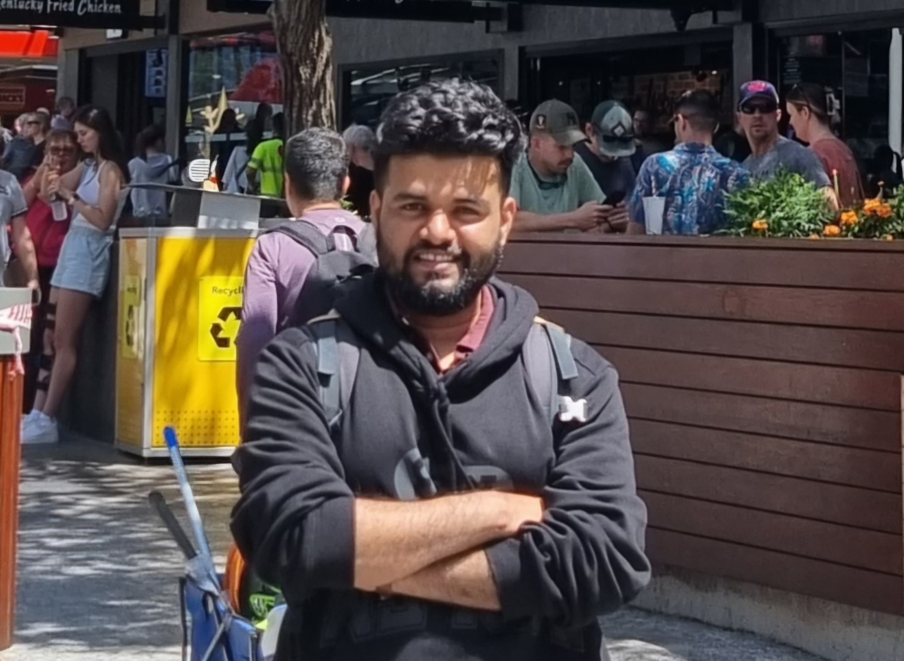

## Welcome!

I am currently a postdoctoral researcher at Palacký University Olomouc, Czech Republic. I am interested in open quantum systems, quantum thermodynamics, non-equilibrium statistical mechanics, quantum optics etc.

I've been fortunate enough to work on and study a variety of different topics within transportation, including the famous 'Carmageddon,' Los Angeles' innovative ExpressPark program, and the Vision Zero traffic safety initiative. In my spare time, I've undertaken other fun transportation-related projects, such as the Los Angeles Bus Map. 

Please take a look at my [resume](documents/masterCV.pdf) or reach out to me at [rahul16shastri@gmail.com](mailto:rahul16shastri@gmail.com)  
 
 
 
 
---
