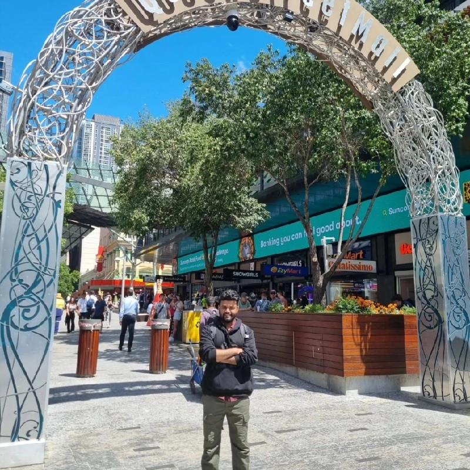

## Welcome!

I am a theoretical physicist with a PhD in Physics, with research interests in open quantum systems, quantum thermodynamics, and quantum optics. My research so far has focused on understanding how environmental effects such as decoherence, dissipation, and dephasing affect the fragile nature of quantum systems and devices.

My current interests are expanding toward quantum computing, particularly Hamiltonian simulation, quantum algorithms, quantum optimization, and fault-tolerant quantum computing.

I enjoy working on problems where fundamental physics can lead to new ways of thinking about technology. I am always interested in exchanging ideas and collaborating with people working across quantum physics and quantum computing.

Please take a look at my [resume](documents/masterCV.pdf) or reach out to me at [rahul16shastri@gmail.com](mailto:rahul16shastri@gmail.com). I also maintained Linkdin profile [Linkdin](https://www.linkedin.com/in/rahul-shastri-34a626144/). 

---
